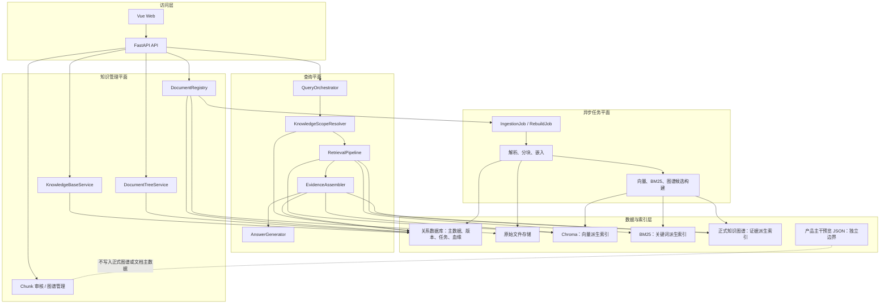
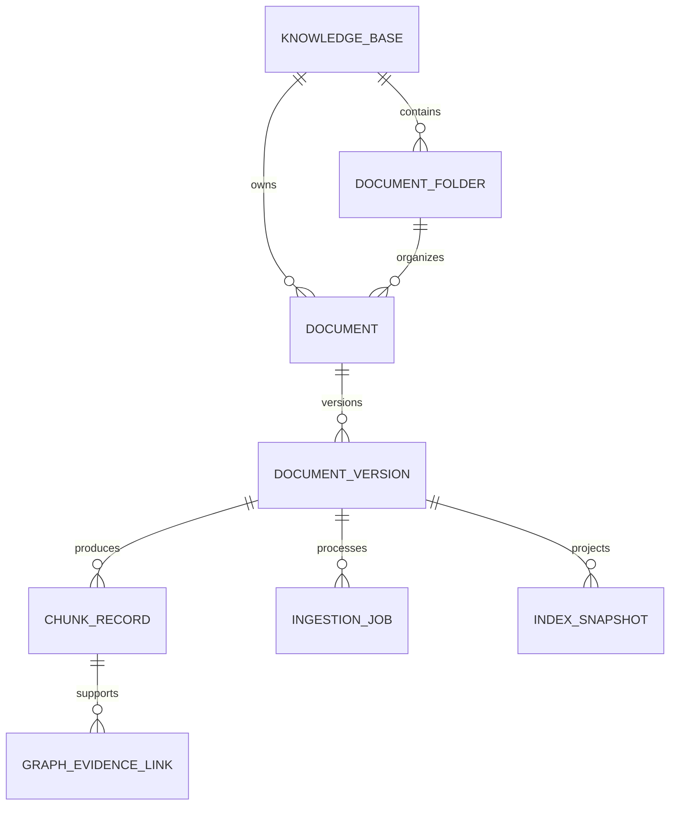
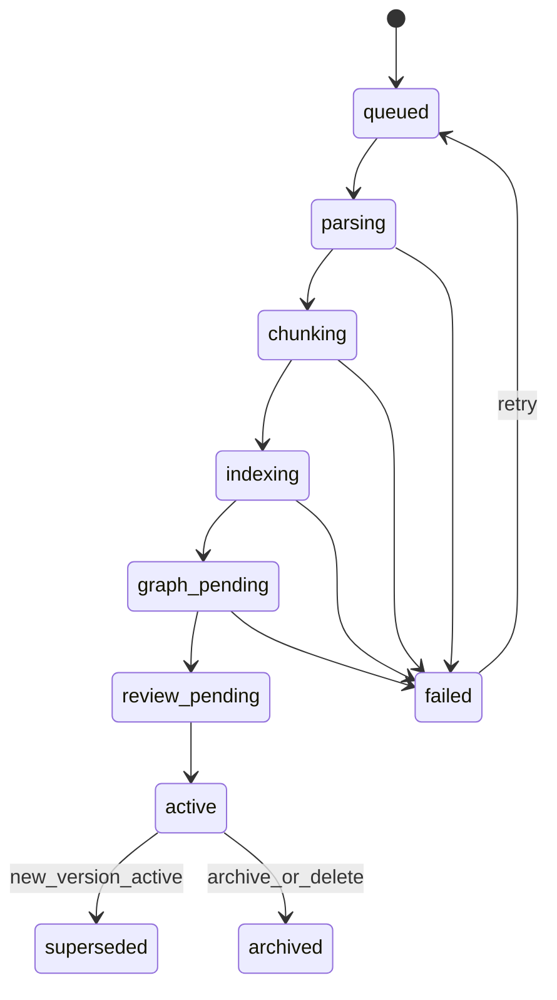

# RAG 架构升级 PRD

| 项目 | 内容 |
|---|---|
| 版本 | V1.0 |
| 基线日期 | 2026-07-20 |
| 范围 | 知识库、文档树、文档版本、入库任务、派生索引与 RAG 编排架构 |
| 实施原则 | 先升级领域边界与数据主线，保留单代码库；不以拆微服务为目标 |

## 1. 背景

现有系统已提供文档入库、结构化分块、Chunk 审核、Hybrid 检索、重排、图谱增强、候选审批、博客同步和问答证据链。

当前主要问题不在检索算法，而在知识资产的主数据边界：知识库、目录和文档版本通过 `kb_name`、`kb_path`、`file_index.json` 和 Chunk 元数据共同表达；Chroma、BM25、SQLite 与 JSON 各自保存部分运行状态；扫描、解析、索引构建又与在线 FastAPI 进程耦合。

本升级将建立唯一的知识资产主线：

```text
知识库 → 文档树 → 文档 → 文档版本 → Chunk
                                      ├─ 向量索引
                                      ├─ BM25 索引
                                      └─ 图谱证据与候选
```

向量、关键词和图谱均为可重建的派生索引；文档主数据不再依赖物理文件路径或 JSON 作为唯一事实来源。

## 2. 目标与边界

### 2.1 目标

1. 将知识库、目录树、文档、文档版本、任务和索引版本建模为正式对象。
2. 让任意回答可追溯至知识库、逻辑目录、文档版本、Chunk、索引版本和图谱证据。
3. 将耗时的解析、Embedding、索引重建与图谱候选构建改为可查询、可重试的后台任务。
4. 保持现有问答、审核、博客、正式图谱和产品关系主干预览功能可用并可平滑迁移。
5. 在同一代码库内拆清查询、知识管理和异步处理边界，为后续扩容预留稳定接口。

### 2.2 非目标

- 本期不替换 Chroma、BM25、SQLite 或 Ollama。
- 本期不拆分微服务、不引入服务网格。
- 本期不重做 Chunk 算法、Reranker、图谱抽取算法或正式图谱语义。
- 本期不改变产品关系主干预览的 JSON 存储和其与正式图谱的隔离边界。
- 本期仅预留访问策略字段，不实现完整多租户和企业权限产品。

## 3. 用户与价值

| 角色 | 升级前问题 | 升级后价值 |
|---|---|---|
| 资料管理员 | 难确认文件归属、版本及索引状态 | 管理知识库、目录、文档版本和任务状态 |
| Chunk 审核员 | 难追溯 Chunk 的完整文档处理上下文 | 从 Chunk 回溯文档、版本、章节、策略与索引 |
| 问答用户 | 不清楚答案使用了哪套资料、哪个版本 | 可按知识库/目录提问，来源显示路径与版本 |
| 图谱维护者 | 证据与文档重建影响范围不透明 | 识别实体/关系证据的文档版本与有效状态 |
| 运维人员 | 批处理任务与在线问答抢占同一进程 | 单独监控、重试和恢复入库任务 |

## 4. 目标架构



### 4.1 架构职责

| 边界 | 负责 | 不负责 |
|---|---|---|
| 文档主数据层 | 知识库、目录、文档、版本、任务、血缘和状态 | 检索排序、向量计算、图谱推理 |
| 向量与 BM25 索引层 | 检索投影、元数据过滤 | 文档树和版本的业务事实 |
| 正式知识图谱 | 实体、关系、别名和版本化 Chunk 证据 | 替代 Chunk 正文；保存预览图数据 |
| 产品主干预览 | 预览实体关系编辑 | 写入正式图谱、文档主数据或 Chunk 证据 |
| 查询平面 | 低延迟范围解析、检索编排、证据与答案生成 | 解析文件、批量重建 |
| 异步任务平面 | 可重试执行入库、重建与索引构建 | 同步阻塞问答请求 |

## 5. 核心数据模型



| 对象 | 关键字段 | 规则 |
|---|---|---|
| `knowledge_bases` | `id`、`name`、`status`、`owner`、`default_retrieval_policy` | 初始迁移“文章附件”“已发布文章”；名称唯一，ID 不依赖物理目录名 |
| `document_folders` | `id`、`knowledge_base_id`、`parent_id`、`name`、`path_key` | 同级名称唯一；逻辑移动不重写历史版本 |
| `documents` | `id`、`knowledge_base_id`、`folder_id`、`display_name`、`source_type` | 逻辑文档身份；相同文档内容更新后新增版本而非新身份 |
| `document_versions` | `id`、`document_id`、`version_no`、`content_hash`、`source_uri`、`parser_version`、`chunk_policy_id`、`embedding_model`、`status` | 同一文档版本号递增；只有一个版本可 `active` |
| `chunk_records` | `id`、`document_version_id`、`chunk_uid`、`section_path`、`review_status`、`vector_status` | `chunk_uid` 保持与 Chroma ID 一一对应；Chunk 是版本产物 |
| `ingestion_jobs` | `id`、`job_type`、`document_version_id`、`status`、`attempt`、`error_code` | 可追踪、可重试、幂等 |
| `index_snapshots` | `id`、`index_type`、`document_version_id`、`build_version`、`status` | 记录向量、BM25、图谱构建的输入版本及结果 |

### 5.1 当前字段迁移映射

| 当前位置 | 升级后来源 | 迁移策略 |
|---|---|---|
| `kb_name` | `knowledge_bases.name` 的检索投影 | 保留为 Chroma 元数据，改由主数据同步写入 |
| `kb_path` | `document_folders.path_key` | 保留为检索过滤和来源展示字段 |
| `file_index.json` | 文档、版本、Chunk 与索引快照表 | 先双写和只读校验，再降级为兼容导出 |
| `doc_category` | 文档版本与 Chunk 业务分类 | 保持审核、图谱和检索接口兼容 |
| `document_profile` | `chunk_policy_id` 与解析配置 | 保留当前 Profile 名称与继承规则 |
| `chunk_uid` | `chunk_records.chunk_uid` | 不改变存量 ID，避免无谓重建 |

## 6. 功能需求

### FR-01 知识库与文档树

- 提供知识库列表、详情、启用/停用状态和默认检索策略。
- 在知识库内支持目录创建、重命名、移动和归档；目录移动后，新的检索与来源展示使用新路径，历史版本保留路径快照。
- 扫描器负责将物理路径映射为逻辑目录；本期不要求物理文件系统与逻辑目录双向同步。
- 知识库和目录范围必须可用于上传归属、文档浏览、Chunk 筛选和问答过滤。

### FR-02 文档与版本

- 上传、扫描和博客发布必须创建或定位逻辑文档，再创建文档版本。
- 内容哈希未变化时不得重复创建版本、Chunk 或 Embedding。
- 内容变化时创建新版本；旧版本进入 `superseded`，新版本满足激活条件后才替换检索范围。
- 删除前必须生成影响预览：版本、Chunk、向量、BM25、图谱证据与候选批次。

### FR-03 异步入库任务



- API 接收上传或扫描事件后创建任务并返回任务 ID，不在请求内执行完整批处理。
- 任务记录输入版本、执行步骤、尝试次数、开始/结束时间、错误码和错误摘要。
- 同一版本和构建参数的并发任务必须去重；重试不得生成重复 Chunk 或重复图谱候选。
- `active` 的最低条件：向量与 BM25 构建成功，且所有需检索的 Chunk 满足当前审核策略。

### FR-04 派生索引与一致性

- Chroma、BM25 和正式图谱必须通过统一的版本化构建请求执行。
- 每次构建写入 `index_snapshots`，记录索引类型、构建参数版本、输入文档版本、结果和失败原因。
- 回答检索只使用 `active` 文档版本下满足审核状态要求的 Chunk。
- 一致性检查必须识别：主数据存在但索引缺失、索引存在但版本无效、图谱证据指向失效 Chunk、版本与 Embedding 模型不一致。

### FR-05 查询编排调整

将现有 `RagChain` 分为以下协作组件：

| 组件 | 职责 | 兼容要求 |
|---|---|---|
| `KnowledgeScopeResolver` | 解析知识库、目录、分类、版本和审核范围 | 保留 `kb_name`、`doc_category` 与未指定范围时的自动路由 |
| `RetrievalPipeline` | 保留向量/BM25/Hybrid、图谱增强、重排与质量策略 | 不改变现有检索方法和默认审核范围 |
| `EvidenceAssembler` | 构建引用、来源、冲突和证据缺口 | 保持现有来源编号与调试证据链格式 |
| `AnswerGenerator` | 调用问答模型并输出 JSON/SSE | 保持 `/query`、`/query/stream` 响应兼容 |

- 查询范围优先级：请求显式指定 > 页面选择的知识库/目录 > 现有关键词和 Helper LLM 路由 > 两库合并兜底。
- 图谱增强继续只作为检索增强，不替代 Chunk 正文作为回答事实来源。
- `/admin/qa-debug` 必须输出所解析的版本范围和索引快照信息。

### FR-06 管理界面

- 新增“知识库与文档”管理入口，至少包括知识库列表、目录树、文档列表、版本列表、入库任务、索引状态和失败重试。
- Chunk 审核台新增文档树路径、文档版本、解析策略和索引状态展示；保留原筛选、编辑和批量审核操作。
- 问答来源栏新增知识库、逻辑目录和文档版本。
- 正式图谱实体证据详情显示文档版本状态；已替代或失效证据必须明确标识。

### FR-07 正式图谱与预览边界

- 正式图谱的 `entity_chunk_links` 必须关联版本化 `chunk_records`，并可追溯至 `document_version`。
- 文档版本替代后，旧证据链接不得静默指向新版本；只能由候选治理或人工操作迁移、保留或失效。
- `data/product_relation_backbone_preview.json` 继续只服务预览模式；不得写入文档主数据、正式图谱或正式索引。

## 7. 接口调整

### 7.1 新增接口契约

| 接口 | 用途 |
|---|---|
| `GET/POST /admin/knowledge-bases` | 列表、创建知识库 |
| `GET/PATCH /admin/knowledge-bases/{id}` | 知识库详情和状态维护 |
| `GET/POST /admin/knowledge-bases/{id}/folders` | 文档树查询和目录创建 |
| `PATCH /admin/document-folders/{id}` | 重命名、移动、归档目录 |
| `GET /admin/documents` | 按知识库、目录、状态查询文档 |
| `GET /admin/documents/{id}/versions` | 文档版本与索引状态 |
| `POST /admin/documents/{id}/versions/{version_id}/retry` | 重试失败入库/索引任务 |
| `GET /admin/ingestion-jobs` | 任务状态、失败原因和处理历史 |
| `GET /admin/consistency/document-index` | 文档版本与派生索引一致性检查 |

### 7.2 现有接口兼容

- `/upload` 保持接收文件，响应增加 `document_id`、`document_version_id`、`job_id`、`status`；不再承诺响应前已完成完整入库。
- `/scan` 改为发现并创建扫描任务，保留现有统计字段并增加任务标识。
- `/knowledge-bases` 保留名称列表，后续可增加 ID、状态和描述字段。
- `/query`、`/query/stream` 保持 `kb_name`；新增可选 `knowledge_base_id`、`folder_id`、`document_version_id` 过滤字段。

## 8. 迁移与回滚

### 8.1 阶段一：主数据回填与双写

1. 新建主数据与任务表，不修改现有 Chroma ID。
2. 基于 `file_index.json`、`watch_directory` 和 Chroma 元数据回填知识库、目录、文档、版本与 Chunk 记录。
3. 输出迁移报告：未映射文件、重复哈希、孤立 Chunk、失效图谱证据和缺失 Profile。
4. 新上传和扫描同时写入新主数据与现有 JSON；问答仍读取原检索字段。

### 8.2 阶段二：任务化与索引血缘

1. 为新入库文档建立状态机与 `index_snapshots`。
2. 解析、Embedding、BM25 重建和候选构建由 Worker 执行，FastAPI 仅投递与查询。
3. 一致性检查以新主数据为准，保留原 `/audit/consistency` 的兼容输出。
4. 新版本只在索引完成、检查通过、审核范围满足条件后切换为 `active`。

### 8.3 阶段三：查询与界面切换

1. 查询范围、管理页面和来源展示改读新主数据。
2. `file_index.json` 降级为兼容导出或缓存，不再承担版本和索引真相。
3. 保留两个发布周期双读校验，比较旧/新范围过滤、Chunk 数和检索结果。
4. 差异清零或明确豁免后，停止旧主数据写入。

### 8.4 回滚原则

- 迁移前备份 `file_index.json`、Chroma 集合、正式 SQLite 图谱和任务元数据。
- 新版本切换失败时，上一 `active` 版本必须保持可检索。
- 正式图谱候选审批与产品主干预览不随文档主数据迁移自动重写。

## 9. 实施阶段与验收

| 阶段 | 交付内容 | 验收标准 |
|---|---|---|
| P1：主数据底座 | 表结构、回填工具、知识库/目录/文档/版本查询 API | 有效文件索引均映射到文档和版本；异常项可列出；不改变既有 Chunk ID |
| P2：版本化入库 | 上传/扫描双写、版本状态机、任务列表 | 相同哈希不重复向量化；内容变化产生新版本；失败重试无重复 Chunk |
| P3：索引契约 | `index_snapshots`、一致性检查、版本激活 | 每个 active 版本可验证 Chroma、BM25 和图谱证据状态；异常版本不得激活 |
| P4：查询与界面 | 范围解析、来源展示、知识库/文档树页面 | 既有问答、审核台、图谱页回归通过；可按知识库/目录检索并显示版本来源 |
| P5：异步化与切换 | Worker、任务投递、双读校验、旧索引降级 | 大文件与批量重建不阻塞问答；双读差异处理完成后切换主数据 |

## 10. 质量指标

| 指标 | 目标 |
|---|---|
| 文档主数据回填率 | 100% 有效文件索引映射到 `document` 与 `document_version`，异常项可追踪 |
| Chunk 血缘覆盖率 | 100% 可检索 Chunk 可回溯至文档版本 |
| 索引一致性 | active 版本的向量/BM25 一致性为 100%，图谱证据异常可检测 |
| 重复入库 | 相同内容哈希不产生新增 Chunk 或 Embedding 调用 |
| 任务恢复 | 重试不产生重复 Chunk、BM25 条目或图谱候选 |
| 查询兼容 | 既有问答、流式问答、Chunk 审核、正式图谱和预览图谱回归通过 |
| 在线隔离 | 入库或重建期间，问答 API 仍可接受请求并返回可观测状态 |

## 11. 风险与约束

| 风险 | 应对 |
|---|---|
| 历史路径、中文文件名、JSON 字段不一致 | 以哈希、现有 Chunk ID 和相对路径三重校验，输出异常清单后人工确认 |
| 新旧索引并存造成检索变化 | 双读对比、固定评测集、灰度切换；不改变存量 Chunk ID |
| 任务异步化改变上传体验 | 前端清晰显示任务状态；仅在 `active` 后标记为可检索 |
| 图谱证据随版本替换而错误迁移 | 证据链接始终指向版本化 Chunk，仅由治理或人工流程迁移 |
| 过早微服务化 | 先采用模块化单体 + 独立 Worker；稳定后再评估物理拆分 |

## 12. 源码对齐与后续设计输入

- 知识库路由与范围字段：`rag_knowledge/api/routes.py`、`rag_knowledge/services/rag.py`
- 扫描、索引、分类和 Profile：`rag_knowledge/services/scanner.py`
- 解析与分块：`rag_knowledge/services/loader.py`
- 向量与 BM25：`rag_knowledge/repository/vector_store.py`、`rag_knowledge/services/bm25_store.py`
- 正式图谱与候选治理：`rag_knowledge/services/knowledge_graph.py`、`rag_knowledge/services/graph_extraction/`
- 预览图谱隔离：`rag_knowledge/services/product_backbone_preview.py`
- 受控重建：`rag_knowledge/services/rebuild_coordinator.py`

本 PRD 批准后，应进一步产出数据库 DDL、迁移与回滚设计、Worker 运行方案、模块接口定义、前端信息架构、OpenAPI、双读校验计划与分阶段测试用例。
