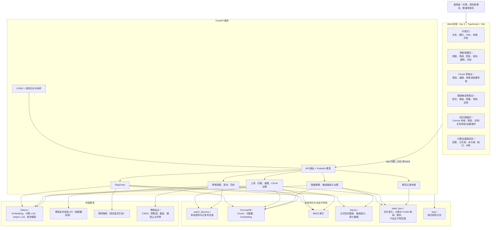
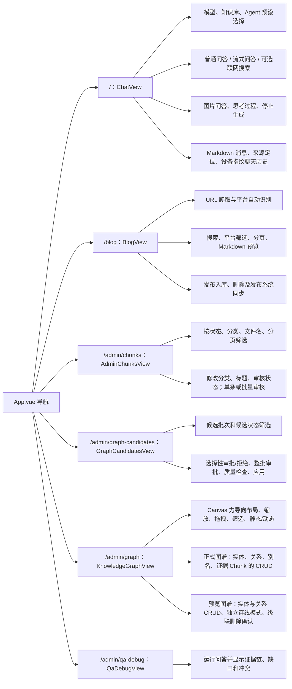
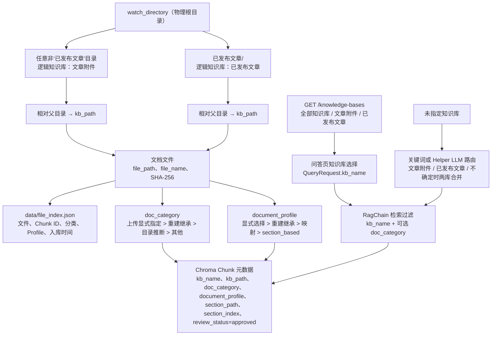
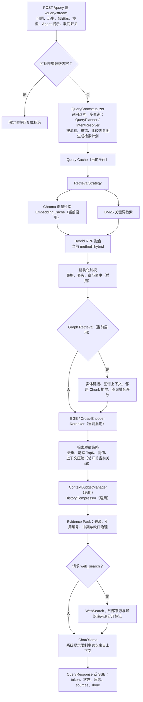
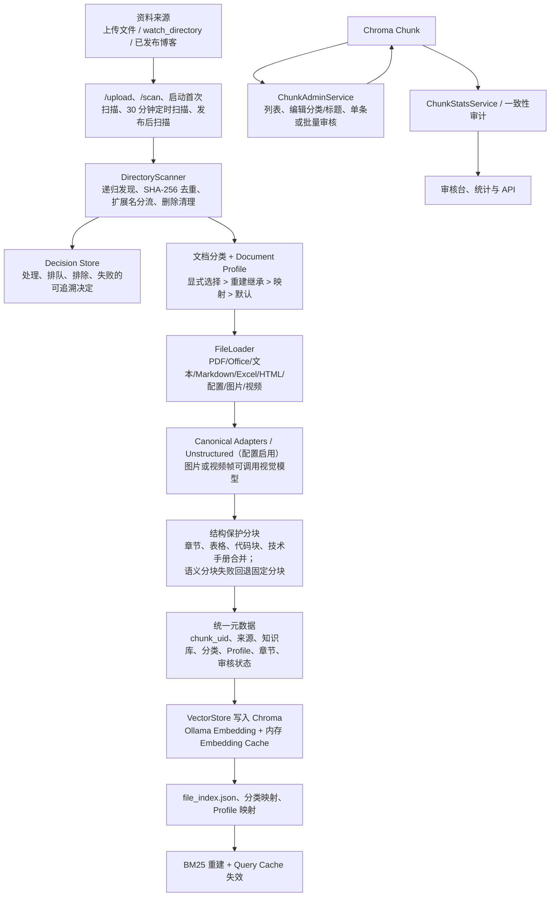
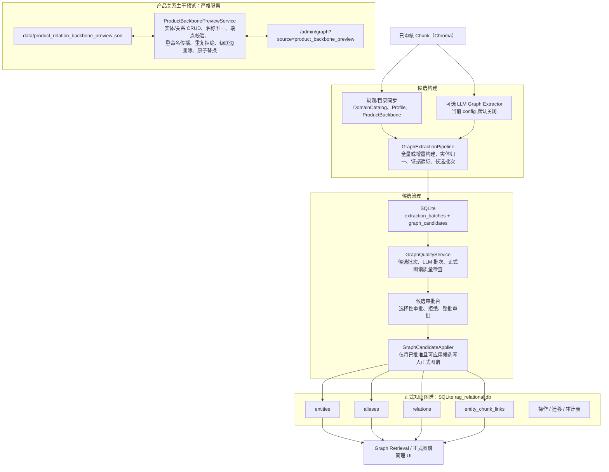
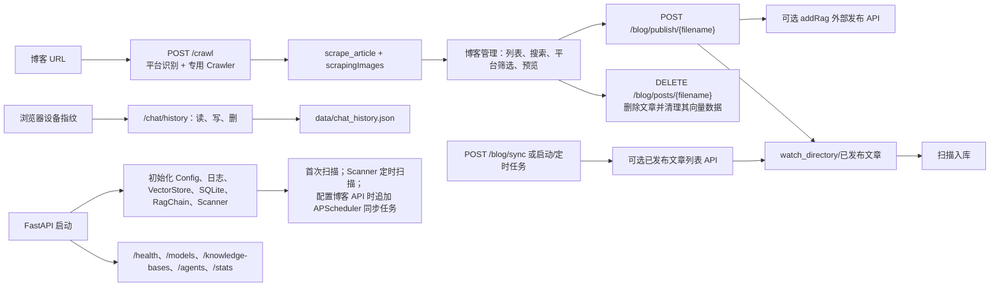

# 当前项目完整架构图（源码基线）

> 基线：2026-07-20。本说明以 `rag_knowledge/`、`web/src/`、`config.ini`、`run.py` 和 `rag_knowledge/api/routes.py` 为准；历史 PRD 与旧架构说明不作为当前能力依据。
>
> 图中的“可选”表示代码已经接入、但当前 `config.ini` 关闭；“外部”表示由本项目调用或代理而非本项目持久化。

## 1. 系统全景

## 2. 前端信息架构与页面能力

所有页面经 `web/src/api/index.ts` 访问 `/api`；开发期 Vite 将其反向代理到 FastAPI 的 `:10605`，并移除 `/api` 前缀。

## 3. 知识库逻辑层与文档树

当前实现没有独立命名为 `DocTree` 的服务或表；文档树由 `watch_directory` 的真实目录、`file_index.json` 和每个 Chunk 的元数据共同表达。知识库是两个固定逻辑分区，而非各自独立的 Chroma 集合。

因此，图中的“知识基底”应理解为：一个 Chroma 向量存储上的两个逻辑知识库，加上目录树、分类、Profile 和审核状态构成的检索范围；不是额外的树数据库或第三个图数据库。

## 4. 问答与检索链路

补充：`POST /query/image` 走视觉模型流式回答；`POST /admin/qa-debug` 使用同一问答链输出可审查的证据链。默认检索仅使用 `approved` Chunk。

## 5. 文档入库、索引与 Chunk 治理

重建不直接手工清库：`POST /rebuild` 使用 `RebuildCoordinator`，包含互斥锁、暂存集合、扫描、审计、切换和清理；`/audit/consistency` 提供库一致性检查。切换 embedding 模型后必须执行重建。

## 6. 知识图谱、候选治理与预览主干

正式图谱通过 `KnowledgeGraphService` 支持实体、关系、实体别名和实体—Chunk 证据链接的读写；删除实体会级联删除关系和证据链接。预览图谱不写 SQLite、不会启用正式图谱的 alias 或 Chunk 功能，也不与正式 API 混用。

## 7. 博客、聊天和运行维护

## 8. 全部已暴露 API（按业务分组）

| 分组 | 接口 | 当前职责 |
|---|---|---|
| 运行与目录 | `GET /models`、`GET /knowledge-bases`、`GET /agents`、`GET /health` | 模型、知识库、Agent 预设、健康信息 |
| 问答 | `POST /query`、`POST /query/stream`、`POST /query/image` | JSON 问答、SSE 问答、图片 SSE 问答 |
| 入库与统计 | `POST /upload`、`POST /scan`、`GET /stats`、`GET /stats/chunks`、`GET /scan/index`、`GET /audit/consistency` | 上传、扫描、统计、索引和一致性检查 |
| Chunk 治理 | `GET /admin/chunks`、`PATCH /admin/chunks/{chunk_id}`、`POST /admin/chunks/batch-review`、`POST /review/status` | 分页列表、元数据更新、批量或单条审核 |
| 配置与重建 | `POST /config/embedding-model`、`POST /rebuild` | 切换 embedding 模型、受控重建 |
| 博客 | `POST /crawl`、`GET /blog/posts`、`GET /blog/posts/{filename}`、`DELETE /blog/posts/{filename}`、`POST /blog/publish/{filename}`、`POST /blog/sync` | 抓取、读取、删除、发布入库、外部发布内容同步 |
| 聊天历史 | `GET /chat/history`、`PUT /chat/history`、`DELETE /chat/history` | 设备指纹维度的历史持久化 |
| 诊断 | `POST /admin/qa-debug` | 输出回答及证据链审查结果 |
| 正式图谱读取 | `GET /admin/knowledge_graph/data` | 按可选文档分类返回节点、边 |
| 正式图谱实体 | `POST /admin/knowledge_graph/entities`、`PATCH /admin/knowledge_graph/entities/{entity_id}`、`DELETE /admin/knowledge_graph/entities/{entity_id}` | 实体 CRUD（删除级联） |
| 正式图谱关系 | `POST /admin/knowledge_graph/relations`、`DELETE /admin/knowledge_graph/relations/{relation_id}` | 创建、删除关系 |
| 正式图谱别名 | `GET /admin/knowledge_graph/entities/{entity_id}/aliases`、`POST /admin/knowledge_graph/entities/{entity_id}/aliases`、`DELETE /admin/knowledge_graph/aliases/{alias_id}` | 别名管理 |
| 正式图谱证据 | `POST /admin/knowledge_graph/entities/{entity_id}/chunks`、`DELETE /admin/knowledge_graph/entities/{entity_id}/chunks/{chunk_id}`、`GET /admin/knowledge_graph/entities/{entity_id}/chunks` | 实体与 Chunk 的证据关联管理 |
| 产品主干预览 | `GET /admin/knowledge_graph/product_backbone_preview`、`POST/PATCH/DELETE .../entities`、`POST/DELETE .../relations` | 仅 JSON 预览图的实体、关系 CRUD |
| 图谱候选 | `GET /admin/graph-candidates/batches`、`GET /admin/graph-candidates/batches/{batch_id}/candidates`、`POST .../review`、`POST .../apply`、`GET .../quality` | 候选批次、审批、受控应用、质量检查 |

## 9. 组件职责索引

| 层 | 组件 | 已有小功能 |
|---|---|---|
| API | `routes.py`、`models/api.py`、`middleware.py` | 路由、参数和响应校验、SSE、文件魔数校验、请求日志 |
| 资料解析 | `scanner.py`、`loader.py`、`unstructured_loader.py`、`canonical_adapters.py`、`document_support.py` | 文件发现、哈希去重、格式判定、结构化解析、图片/视频处理、入库决策 |
| 分块治理 | `document_profiles.py`、`semantic_chunker.py`、`section_chunk_merge.py`、`chunk_admin.py`、`chunk_stats.py`、`chunk_health_audit.py` | Profile 策略、语义/固定回退分块、章节合并、审核、统计、健康审计 |
| 存储 | `vector_store.py`、`bm25_store.py`、`relational_db.py`、`embedding_cache.py`、`chat_storage.py` | Chroma CRUD 与邻居查询、BM25、SQLite 迁移、Embedding 缓存、聊天历史 |
| 检索 | `retrieval_strategy.py`、`query_contextualizer.py`、`query_planner.py`、`retrieval_intent.py`、`reranker.py`、`retrieval_quality.py` | Vector/BM25/Hybrid-RRF、多查询、意图计划、重排、质量后处理 |
| 证据与生成 | `rag.py`、`evidence_pack.py`、`context_budget.py`、`history_compressor.py`、`web_search.py`、`agent_service.py` | 受控提示词、来源编号、Token 预算、历史摘要、显式联网、Agent 预设 |
| 图谱 | `knowledge_graph.py`、`graph_retrieval.py`、`graph_extraction/`、`graph_governance.py`、`graph_audit.py` | 正式图谱 CRUD、检索增强、候选抽取、审批守卫、审计与质量检查 |
| 图谱同步与迁移 | `domain_catalog*.py`、`profile_graph_sync.py`、`product_backbone_graph_sync.py`、`graph_text_migration.py`、`graph_manual_export.py` | 目录/档案/产品主干同步、文本迁移、人工导出 |
| 运维 | `rebuild_coordinator.py`、`safe_rebuild.py`、`knowledge_base_consistency.py`、`runtime_guard.py`、`evaluation/` | 原子重建、运行时保护、一致性检查、评测集与指标运行 |
| 博客 | `blog_crawler.py`、`blog_syncer.py` | 多平台抓取、图片下载、发布、外部已发布文章同步 |

## 10. 当前配置开关与边界

| 能力 | 当前 `config.ini` | 架构含义 |
|---|---:|---|
| 主检索 | `hybrid` + `rrf` | 同时使用 Chroma 和 BM25，再做 RRF 融合 |
| Reranker | 开启 | 粗召回后由 BGE 重排为最终上下文 |
| Query Planner | 开启 | 流程、排错、比较等问题可扩大召回与邻居范围 |
| 结构化检索 | 开启 | 表格、表头和章节命中加权 |
| Graph Retrieval | 开启 | 正式图谱用于检索增强，不替代 Chunk 事实来源 |
| 图谱 LLM 抽取 | 关闭 | 代码可用，但不会因当前配置主动调用 LLM 抽取 |
| 检索质量总开关 | 关闭 | 质量策略代码存在，当前不进入主链路 |
| Context Budget / 历史摘要 | 开启 | 对上下文和长对话实施预算控制 |
| Query Cache | 关闭 | 不复用问答检索结果；Embedding Cache 开启 |
| 外部博客同步与发布 | URL 为空 | 启动时及定时任务不会调用外部博客 API |
| 产品主干预览 | 独立 JSON | 与正式 SQLite 图谱、正式图谱 API 和证据链接严格隔离 |

## 11. 源码追溯

- 启动与依赖装配：`run.py`、`rag_knowledge/__main__.py`
- 对外接口：`rag_knowledge/api/routes.py`、`rag_knowledge/models/api.py`
- 问答链：`rag_knowledge/services/rag.py`、`rag_knowledge/services/retrieval_strategy.py`
- 入库链：`rag_knowledge/services/scanner.py`、`rag_knowledge/services/loader.py`
- 图谱链：`rag_knowledge/services/knowledge_graph.py`、`rag_knowledge/services/graph_extraction/pipeline.py`
- 前端页面与接口：`web/src/router/index.ts`、`web/src/views/`、`web/src/api/index.ts`
- 运行开关：`config.ini`
